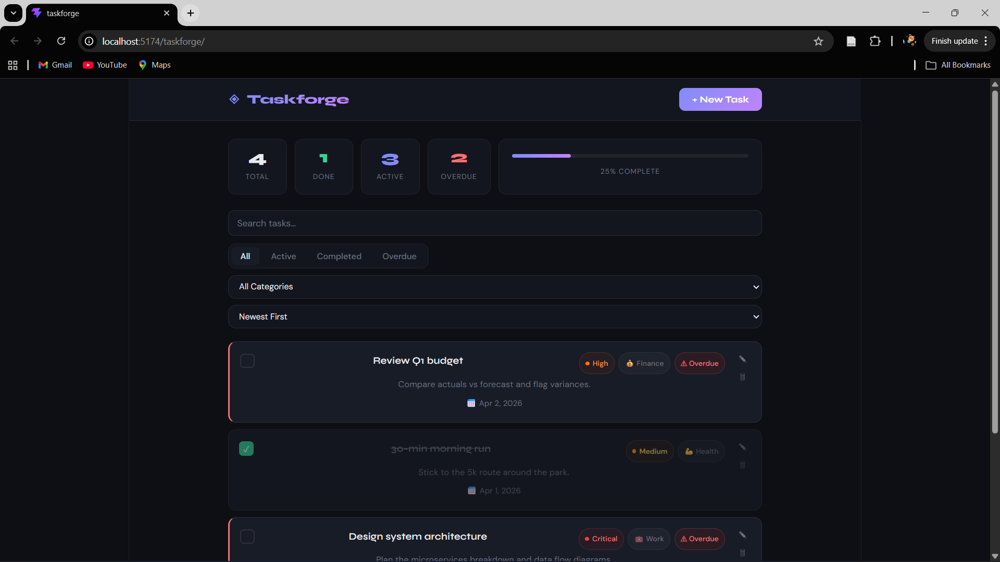
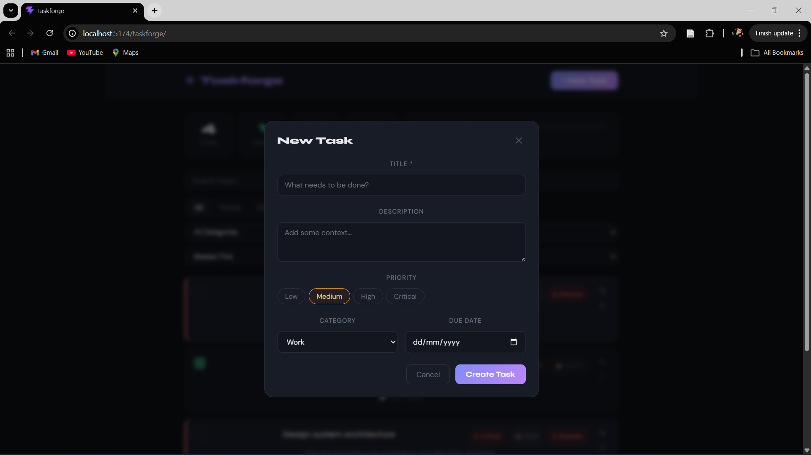

# ◈ Taskforge

> A modern task management application built with React, featuring full CRUD operations, smart filtering, priority levels, and real-time progress tracking.

## 🔗 Live Demo

👉 https://tsegale.github.io/taskforge/

---

## 🚀 Features

- Full CRUD operations (create, update, delete tasks)
- Smart filtering (Active, Completed, Overdue)
- Live search across title and description
- Priority levels (Low → Critical)
- Automatic overdue detection
- Real-time stats dashboard with progress tracking

---

## 🛠 Tech Stack

- React (Vite)
- JavaScript (ES2022)
- CSS

---

## 📸 Screenshots

_(Add screenshots here — VERY IMPORTANT)_

```md


```

⚙️ How It Works

- Tasks are stored in application state using React hooks
- Filtering and sorting are handled dynamically in the UI
- Overdue tasks are automatically detected based on due dates
- UI updates in real-time without page reloads

🧠 Key Concepts Demonstrated

- Component-based architecture
- State management with React hooks
- Dynamic rendering and conditional UI
- Filtering, sorting, and search logic
- Clean UI/UX design principles

🚀 Getting Started

- git clone https://github.com/tsegale/taskforge.git
- cd taskforge
- npm install
- npm run dev

📌 Future Improvements

- Local storage / database persistence
- Drag-and-drop task reordering
- Notifications and reminders
- Mobile optimization

📄 License

MIT © 2026
